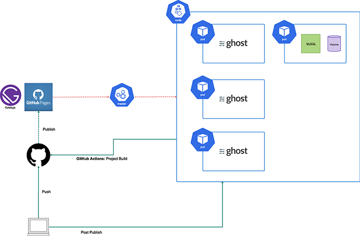

<style>
section {
    font-size: 28px
}
</style>

# mark MEIZAN マイクロサービス ハンズオン

### Kubernetes で WordPress構築 を体験しよう

---

### 今回のハンズオンの内容



---

### 準備するもの

#### ターミナル

黒い画面をメインで使用しますのでターミナルが必要です。
Windows であれば PowerShell、Mac であれば Terminal.app があれば OK です。

#### クラウドサーバ

さくらインターネット様にさくらのクラウドを 60 台（Master/Worker の 1 人 2 台構成）をご用意いただいてます。

> ありがとうございます :bow:

---

### 支給されているもの

- サーバの IP アドレス・ユーザー・パスワード
- ドメイン

#### 今回使用するソース類の場所について

今回使用するサーバの以下のフォルダに設置しています。

- `/home/handson/workspace/microservice-handson-slide`
- `/home/handson/workspace/microsebrvice-handson-example-site`

---

### 今回のハンズオン内容

Kubernetes の基本的な操作方法を実際に操作しながら、WordPressの構築を目指します。

今回は、ご用意いただいたさくらのクラウドに、必要なソースは全て設置してますので、基本的には、さくらのクラウドに接続して必要なコマンドを実行するのみで進められるようにしています。

---

### Chapter1 - Node/Pod -

[https://kubernetes.io/ja/docs/tutorials/kubernetes-basics/explore/explore-intro/](https://kubernetes.io/ja/docs/tutorials/kubernetes-basics/explore/explore-intro/)

#### Pod

> 1 つ以上のアプリケーションコンテナ(Docker や rkt など)のグループとそれらのコンテナの共有リソースを表す Kubernetes の抽象概念です。 Pod には以下のものが含まれます:
>
> - 共有ストレージ(ボリューム)
> - ネットワーキング(クラスタに固有の IP アドレス)
> - コンテナのイメージバージョンや使用するポートなどの、各コンテナをどう動かすかに関する情報

---

### Chapter1 - Node/Pod -

#### Node

> Pod は常に Node 上で動作します。Node は Kubernetes ではワーカーマシンであり、クラスタによって仮想、物理マシンのどちらであってもかまいません。各 Node はマスターによって管理されます。Node は複数の Pod を持つことができ、Kubernetes マスターはクラスタ内の Node 間で Pod のスケジュールを自動的に処理します。マスターの自動スケジューリングは各 Node で利用可能なリソースを考慮に入れます。

---

### Chapter1 - Node/Pod -

[pod.yaml](./chapter1/pod.yaml)

以下のコマンドで Pod を作成してみましょう。

```
$ kubectl apply -f ./chapter1/pod.yaml
```

Pod の状態を確認します。

```
$ kubectl get pods
```

describe コマンドでより詳細な情報を取得することもできます。

```
$ kubectl describe pods [Pod名]
```

---

### Chapter2 - Volume -

https://kubernetes.io/docs/concepts/storage/volumes/

> コンテナ内のディスク上のファイルは一時的なものであり、コンテナで実行する場合に重要なアプリケーションでは問題が発生します。 まず、コンテナがクラッシュすると、kubelet はコンテナを再起動しますが、ファイルは失われます-コンテナはクリーンな状態で起動します。 次に、コンテナをポッドで一緒に実行する場合、多くの場合、それらのコンテナ間でファイルを共有する必要があります。 Kubernetes Volume の抽象化は、これらの両方の問題を解決します。

---

### Chapter2 - Volume -

[volume.yaml](./chapter2/volume.yaml)

Volume を指定して、2つのコンテナを持つ Pod を作成してみましょう。

```
$ kubectl apply -f ./chapter2/volume.yaml
```

tail コンテナのログが出力されているのが確認できます。

```
$ kubectl logs date-tail -c tail -f
```

Pod に入って、ログがあるか確認してみましょう。

```
$ kubectl exec date-tail -it sh
$ ls -la /var/log/date-tail/output.log
```

---

### Chapter3 - ReplicaSet -

[https://kubernetes.io/ja/docs/concepts/workloads/controllers/replicaset/](https://kubernetes.io/ja/docs/concepts/workloads/controllers/replicaset/)

> ReplicaSet は、ReplicaSet が対象とする Pod をどう特定するかを示すためのセレクターや、稼働させたい Pod のレプリカ数、Pod テンプレート(理想のレプリカ数の条件を満たすために作成される新しい Pod のデータを指定するために用意されるもの)といったフィールドとともに定義されます。ReplicaSet は、指定された理想のレプリカ数にするために Pod の作成と削除を行うことにより、その目的を達成します。ReplicaSet が新しい Pod を作成するとき、ReplicaSet はその Pod テンプレートを使用します。

---

### Chapter3 - ReplicaSet -

[rs1.yaml](./chapter3/rs1.yaml)

ReplicaSet を作成してみましょう。

```
$ kubectl apply -f ./chapter3/rs1.yaml
```

ReplicaSet と Pod の状態を確認します。

```
$ kubectl get replicasets
$ kubectl get pods
```

---

### Chapter3 - ReplicaSet -

`replicas`の値を修正して、Replica を増やしてみます。

[rs2.yaml](./chapter3/rs2.yaml)

```
$ kubectl apply -f ./chapter3/rs2.yaml
$ kubectl get replicasets
$ kubectl get pods
```

scale コマンドで、レプリカ数を増やすこともできます。

```
$ kubectl scale rs kuard --replicas=10
$ kubectl get replicasets
$ kubectl get pods
```

※scale コマンドは即時反映されますが YAML ファイルも修正しておかないと、デグレードする可能性があるので、必ず YAML ファイルにも反映させるようにしましょう。

---

### Chapter3 - Deployment -

[https://kubernetes.io/docs/concepts/workloads/controllers/deployment/](https://kubernetes.io/docs/concepts/workloads/controllers/deployment/)

> Deployment で目的の状態を記述すると、Deployment Controller は制御されたレートで実際の状態を目的の状態に変更します。Deployment を定義して、新しい ReplicaSet を作成したり、既存の Deployment を削除して、すべてのリソースを新しい Deployment で適用できたりすることができます。

Deployment には以下の機能が含まれます。

- ReplicaSet の管理
- Pod のローリングアップデート
- ロールアウトした Pod の履歴を管理
- ロールバック

---

### Chapter3 - Deployment -

[deployment1.yaml](./chapter3/deployment1.yaml)

Deployment を作成してみましょう。

```
$ kubectl apply -f ./chapter3/deployment1.yaml
```

Deployment と Pod の状態を確認します。

```
$ kubectl get deployments
$ kubectl get replicaesets
$ kubectl get pods
```

---

### Chapter3 - Deployment -

次に、kuard イメージのバージョンを修正した版をデプロイしましょう。

```
$ kubectl apply -f ./chapter3/deployment2.yaml
```

デプロイの情報とデプロイの履歴を確認します。

```
$ kubectl get deployments
$ kubectl get replicaesets
$ kubectl get pods
$ kubectl rollout history deployment kuard-service
```

ロールバックしてみましょう。

```
$ kubectl rollout undo deploy kuard-service --to-revision 1
```

---

### Chapter4 - namespace -

```
$ kubectl create namespace handson
```

---

### Chapter4 - ConfigMap/Secret -

#### ConfigMap

https://kubernetes.io/docs/tasks/configure-pod-container/configure-pod-configmap/

> ConfigMap を使用すると、構成のアーティファクトを Image コンテンツから分離して、コンテナ化されたアプリケーションの移植性を維持できます

例えば、MySQL の設定ファイルを ConfigMap で作成し、作成された ConfigMap を MySQL イメージで使用することができます。

---

### Chapter4 - ConfigMap/Secret -

#### ConfigMap

[config-map.yaml](./chapter4/config-map.yaml)

MySQL の設定を ConfigMap で作成してみましょう。

```
$ kubectl apply -f ./chapter4/config-map.yaml
```

ConfigMap を確認します。

```
$ kubectl get configmaps -n handson
```

---

### Chapter4 - ConfigMap/Secret -

#### Secret

https://kubernetes.io/docs/concepts/configuration/secret/

> Kubernetes シークレットオブジェクトを使用すると、パスワード、OAuth トークン、ssh キーなどの機密情報を保存および管理できます。 この情報を秘密に入れることは、ポッド定義またはコンテナーイメージに逐語的に入れるよりも安全で柔軟です。

Secret に保存するデータは base64 でエンコードされた任意のデータを格納できます。
MySQL に渡すパスワードを Secret で作成してみましょう。
まずはパスワードを base64 エンコードします。

```
$ echo -n "user_password" | base64
$ echo -n "root_password" | base64
```

---

### Chapter4 - ConfigMap/Secret -

#### Secret

[secret.yaml](./chapter4/secret.yaml)を修正して、Secret を作成します。

```
apiVersion: v1
kind: Secret
metadata:
  name: mysql-secret
type: Opaque
data:
  MYSQL_ROOT_PASSWORD: "Base64エンコードしたパスワード"
  MYSQL_PASSWORD: "Base64エンコードしたパスワード"
```

```
$ kubectl apply -f ./chapter4/secret.yaml
$ kubectl get secrets -n handson
```

---

### Chapter4 - ConfigMap/Secret -

これまで作成した ConfigMap と Secret を Pod で利用するには以下のようにします。

[mysql.yaml](./chapter4/mysql.yaml)

#### Secret を使う

```
･･･
- name: MYSQL_PASSWORD
    valueFrom:
    secretKeyRef:
        key: MYSQL_PASSWORD
        name: mysql-secret
- name: MYSQL_ROOT_PASSWORD
    valueFrom:
    secretKeyRef:
        key: MYSQL_ROOT_PASSWORD
        name: mysql-secret
･･･
```

---

### Chapter4 - ConfigMap/Secret -

#### ConfigMap を使う

```
    volumeMounts:
    - mountPath: "/etc/mysql/conf.d/"
        name: mysql-config
volumes:
- name: mysql-config
    configMap:
    name: mysql-config-map
```

---

#### ConfigMapとSecretを使ったMySQLのサービスを起動する

ついでに ConfigMap と Secret を使用した MySQL の Pod をデプロイします。

まずは、MySQLのデータを保存するフォルダを Worker に作成します。
```
$ ssh worker
$ mkdir -p /mnt/data/
```

フォルダを作成したら、以下のコマンドを実行します。

```
$ kubectl apply -f ./chapter4/mysql-pv.yaml
$ kubectl apply -f ./chapter4/mysql.yaml
$ kubectl get pods -n handson
```

---

MySQLに接続できるか、ポートフォワーディングで確認します。

```
$ kubectl port-forward [Pod Name] 3306:3306 -n handson
```

ポートフォワーディングが開始したら、別ターミナルで Master に接続し、以下を実行してMySQLに接続してください。

```
$ mysql -u root -p -h 127.0.0.1
Enter [Root Password]
```


---

### Chapter4 - Service -

https://kubernetes.io/ja/docs/tutorials/kubernetes-basics/expose/expose-intro/

> Pod の論理セットと、それらにアクセスするためのポリシーを定義する抽象概念です。各 Pod には固有の IP アドレスがありますが、それらの IP は、Service なしではクラスタの外部に公開されません。Service によって、アプリケーションはトラフィックを受信できるようになります。ServiceSpec で type を指定することで、Service をさまざまな方法で公開することができます。

- ClusterIP (既定値) - クラスタ内の内部 IP で Service を公開します。この型では、Service はクラスタ内からのみ到達可能になります。
- NodePort - NAT を使用して、クラスタ内の選択された各 Node の同じポートに Service を公開します。<NodeIP>:<NodePort>を使用してクラスタの外部から Service にアクセスできるようにします。これは ClusterIP のスーパーセットです。

---

### Chapter4 - Service -

- LoadBalancer - 現在のクラウドに外部ロードバランサを作成し(サポートされている場合)、Service に固定の外部 IP を割り当てます。これは NodePort のスーパーセットです。
- ExternalName - 仕様の externalName で指定した名前の CNAME レコードを返すことによって、任意の名前を使って Service を公開します。プロキシは使用されません。このタイプは v1.7 以上の kube-dns を必要とします。

---

### Chapter4 - Service -

先ほどの MySQL でも Service を定義していたので、セレクタ`app: wordpress-db`に合致する Pod が、ポート 3306 で Pod 内での通信ができるようになっています。

```
apiVersion: v1
kind: Service
metadata:
  name: wordpress-db
spec:
  ports:
    - port: 3306
      protocol: TCP
  selector:
    app: wordpress-db
```

---

### Chapter5 - WordPress -

外部公開するアプリケーションを Deployment で作成します。
今回は前述の通り、WordPress を使います。

[wordpress.yaml](./chapter5/wordpress.yaml)

```
$ kubectl apply -f ./chapter5/wordpress.yaml
$ kubectl get deploy -n handson
$ kubectl get service -n handson
$ kubectl get pods -n handson
```

deployment が完了し、
http://[Worker のグローバルIP]:30080 でアクセスしてアクセスできたら、成功です。
